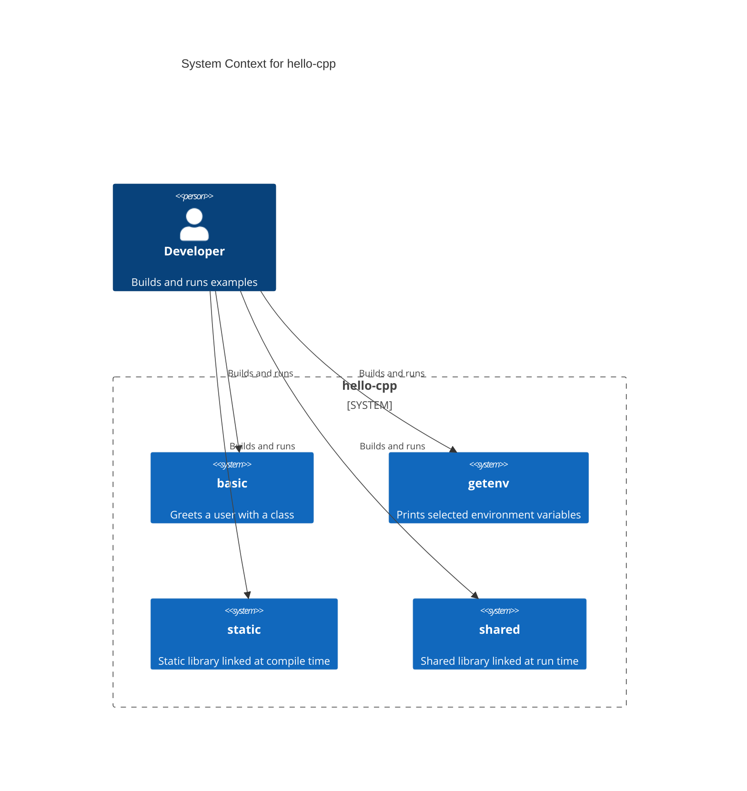
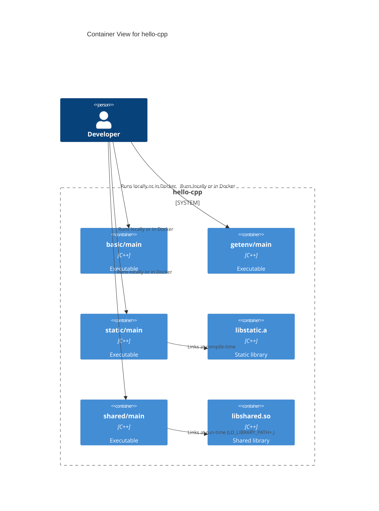

# hello-cpp

Small, self-contained C++ examples that demonstrate:

- A basic executable with a class (`basic`)
- Reading environment variables (`getenv`)
- Building and using a shared library (`shared`)
- Building and linking a static library (`static`)

Each example is a separate subproject with its own `Makefile` and Dockerfile. The root `Makefile` orchestrates building, running, and cleaning all subprojects at once.

## Quick Start

Prerequisites: `g++`, `make` (or Docker if you prefer containerized builds).

- Build everything: `make`
- Run everything: `make run`
- Clean everything: `make clean`

Run a single subproject:

```
cd basic   && make && make run
cd getenv  && make && make run
cd shared  && make && make run   # uses LD_LIBRARY_PATH=.
cd static  && make && make run
```

Docker (per project or via root):

```
make docker-build    # builds all images
make docker-run      # runs all images
make docker-clean    # removes containers/images (plus dangling by label)
```

## Project Structure

- `basic/`: Simple class + executable (`Hello` prints greetings)
- `getenv/`: Prints selected environment variables
- `shared/`: Builds `libshared.so` and an executable that links it at runtime
- `static/`: Builds `libstatic.a` and an executable that links it at compile time
- `scripts/`: Utility scripts used by Docker targets
- `.github/workflows/`: CI for build, Docker, and linting

## What Each Example Shows

- `basic/`
  - Files: `hello.h`, `hello.cpp`, `main.cpp`
  - Concept: Class definition/implementation and a trivial executable

- `getenv/`
  - Files: `main.cpp`
  - Concept: Using `getenv` safely and printing env vars

- `shared/`
  - Files: `shared.h`, `shared.cpp`, `main.cpp`
  - Concept: Building a shared library (`.so`), position-independent code, runtime linking with `LD_LIBRARY_PATH`

- `static/`
  - Files: `static.h`, `static.cpp`, `main.cpp`
  - Concept: Building a static library (`.a`) and linking it into an executable

## CI and Linting

GitHub Actions workflows:

- Build all examples on push/PR: `.github/workflows/c-cpp.yml`
- Build Docker images: `.github/workflows/docker-image.yml`
- Lint: `.github/workflows/lint.yml` (clang-format, cppcheck, clang-tidy)

## C4 Diagrams (Mermaid)

High-level context and container views for the examples.





## Notes

- Each `Makefile` now enables `-std=c++17 -Wall -Wextra -Wpedantic` by default for safer builds. Override with `CXXFLAGS=...` if needed.
- The code avoids `using namespace std;` in headers, uses const-correct interfaces, and prefers automatic storage over raw `new`.
